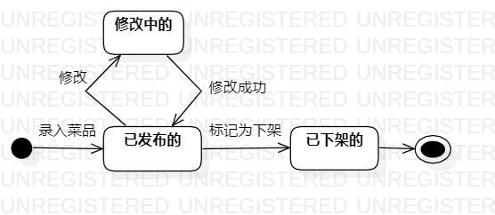

# 实验七：状态建模

### 一、实验目标
    1.掌握对象状态建模方法
    2.画出状态图
    

### 二、实验内容
    1.根据选题的用例规约、活动图等寻找一个关键对象，并创建状态图；
    2.设计该对象的关键状态及状态之间的转变条件。
       
 ### 三、实验步骤
     1.根据实验二的用例及用例规约、实验三的活动图，实验四实验五的类图、实验六的顺序图画出相应的状态图，如下图1所示；
     2.确定了“菜品”一个关键对象；
     3.确定了三个状态分别是：已编辑好的、修改中的、已发布的；
     4.确定了状态之间的转变条件，分别是：输入菜品转变为“已编辑好的”，发布变为“已发布的”；“已发布的”修改为“修改中的”，
     “修改中的”修改成功转变为“已发布的”。
     
     
     

### 四、实验结果

  
  
 ### 五、学习笔记
    1. 对象的状态是：对象所表示的数据。如果数据发生变化，状态就是发生变化；
    2.描述状态：形容词；
    3.可以写不局限于自己用例的。
